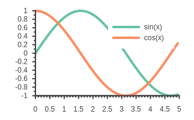
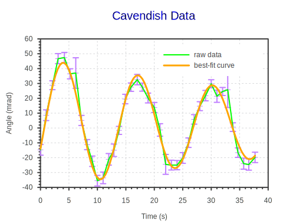

# Crystal Plotting Shard

`Cryplot` is Crystal plotting library powered by `gnuplot`. The goal of the **Cryplot** is to enable you, **Crystal** programmer, to **conveniently plot beautiful graphs** as easy as in other high-level programming languages.

The only external runtime dependencies is [gnuplot](http://www.gnuplot.info/) executable and it need to be in your system path.

[gnuplot-palettes](https://github.com/Gnuplotting/gnuplot-palettes) color palettes are downloaded at shard installation and made available to your use via simply invoking the `plot#palette` and passing in any available palette enum `Cryplot::Palette`.

## Installation

1. Add the dependency to your `shard.yml`:

   ```yaml
   dependencies:
     cryplot:
       github: naqvis/cryplot
   ```

2. Run `shards install`

### Example 1

```crystal
require "cryplot"

# Create a vector with values from 0 to 5 divived into 100 uniform intervals
x = Cryplot.linspace(0.0, 5.0, 100)

# Create a plot object
Cryplot.plot {
  # set color palette
  palette(:set2)

  # Draw a sine graph putting x on the x-axis and sin(x) on the y-axis
  draw_curve(x, x.map { |v| Math.sin(v) }).label("sin(x)").line_width(4)

  # Draw a cosine graph putting x on the x-axis and cos(x) on the y-axis
  draw_curve(x, x.map { |v| Math.cos(v) }).label("cos(x)").line_width(4)

  # Show the plot in a pop-up window
  show

  # Save the plot a PDF file
  save("plot.pdf")
}

```
Running above sample code will produce and show you following plot:

<p align="center">
    
</p>


### Example 2 (Use custom gnuplot commands)

```crystal
require "cryplot"

time = [0.0, 1.0, 2.1, 3.1, 4.2, 5.2, 6.2, 7.2, 8.2, 9.1, 10.0, 11.0, 12.0,
        12.9, 13.8, 14.9, 15.9, 17.0, 17.9, 18.9, 20.0, 21.0, 22.0, 23.0, 24.0, 25.0,
        26.0, 27.0, 28.0, 29.0, 30.0, 31.0, 32.0, 32.9, 33.8, 34.7, 35.7, 36.6, 37.7]

angle = [-14.7, 8.6, 28.8, 46.7, 47.4, 36.5, 37.0, 5.1, -11.2, -22.4, -35.5, -33.6, -21.1,
         -15.0, -1.6, 19.5, 27.5, 32.6, 27.5, 20.2, 13.8, -1.3, -24.5, -25.0, -25.0, -20.2,
         -9.9, 5.8, 14.7, 21.8, 29.8, 21.4, 24.6, 25.8, 0.6, -16.6, -24.0, -24.6, -19.8]

stdvar = [3.6, 3.6, 3.0, 3.4, 3.5, 3.4, 10.3, 3.4, 3.4, 3.5, 3.6, 3.9, 3.9,
          4.2, 2.7, 3.2, 2.8, 3.5, 2.7, 3.3, 3.4, 4.2, 6.7, 3.3, 3.1, 3.6,
          3.2, 3.2, 3.0, 3.5, 2.7, 4.1, 2.7, 12.0, 2.9, 3.2, 3.7, 3.8, 3.5]

Cryplot.plot {
  # Set the Title of the plort
  title("Cavendish Data").title_font_size(20).title_text_color("blue")

  # Set x-axix and y-axis labels
  xlabel("Time (s)")
  ylabel("Angle (mrad)")

  # Adjust the Legend position
  legend.at_top_right

  # Adjust grid , border, style, tics settings
  grid
    .show
    .back
    .line_width(1)
  border.none
  style_fill.border_show
  tics.hide
  border.left.right.top.bottom.back

  # Draw Error Bars
  draw_error_bars_y(time, angle, stdvar).line_width(2).line_color("purple").label_none

  # Draw raw-data line by using the same dataset
  draw("1:2", "lines").line_color("green").line_width(2).label("raw data")

  # custom gnuplot commands (these commands are passed as-is to gnuplot)
  gnuplot("theta(t) = theta0 + a * exp(-t / tau) * sin(2 * pi * t / T + phi)")
  gnuplot("fit theta(x) '#{data_filename}' using 1:2:3 via a, tau, phi, T, theta0")

  # draw best fit curve
  draw("theta(x)", "", "").label("best-fit curve").line_width(3).line_color("orange")

  # Set the size
  size(480, 380)

  # Show the plot in a pop-up window
  show

  # Save the plot in PNG file
  save("best-fit-curve.png")
}
```

Running above sample code will produce and show you following plot:

<p align="center">
    
</p>

Refer to `specs` or `examples` folder for further samples.

## Available Color Palettes

Do you want to change the colors?

All available color palettes and their names can be found [here][gnuplot-palettes].


[gnuplot-palettes]: https://github.com/naqvis/gnuplot-palettes


## Development

To run all tests:

```
crystal spec
```

## Contributing

1. Fork it (<https://github.com/naqvis/cryplot/fork>)
2. Create your feature branch (`git checkout -b my-new-feature`)
3. Commit your changes (`git commit -am 'Add some feature'`)
4. Push to the branch (`git push origin my-new-feature`)
5. Create a new Pull Request

## Contributors

- [Ali Naqvi](https://github.com/naqvis) - creator and maintainer
